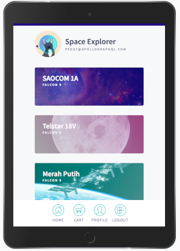

# SpaceX Booking App

This is an interactive app for reserving a seat on an upcoming SpaceX launch.  🚀
Think of it as an Airbnb for space travel! All of the data is real, thanks to the [SpaceX-API](https://github.com/r-spacex/SpaceX-API){:target="_blank"}.

The app includes the following views:

- A login page
- A list of upcoming launches
- A detail view for an individual launch
- A user profile page
- A cart

To populate these views, the app's data graph will connect to two data sources: a REST API and a SQLite database.

Here's what the finished app will look like:



<!-- 
## File structure

The app is split out into two folders:
- `start`: Starting point for the tutorial
- `final`: Final version

From within the `start` and `final` directories, there are two folders (one for `server` and one for `client`). -->

## Installation

To run the app, run these commands in two separate terminal windows from the root:

```bash
cd final/server && npm i && npm start
```

and

```bash
cd final/client && npm i && npm start
```
