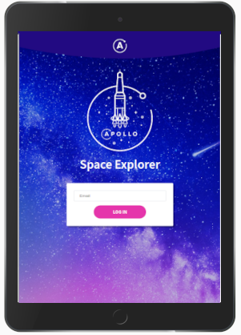
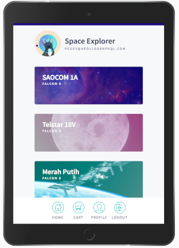

# SpaceX Launch Reservation App

This is an interactive full-stack, GraphQL-powered app with the Apollo platform, for reserving a seat on an upcoming SpaceX launch.  🚀

Think of it as an Airbnb for space travel! All of the data is real, thanks to the [SpaceX-API](https://github.com/r-spacex/SpaceX-API).

The app includes the following views:

- A login page
- A list of upcoming launches
- A detail view for an individual launch
- A user profile page
- A cart

To populate these views, the app's data graph will connect to two data sources: a REST API (from SpaceX) and a SQLite database (this is because the SpaceX API is a read-only data source for fetching launch data, so we also need a writable data source that allows us to store application data, such as user identities and seat reservations).

Here's what the finished app will look like:




## System requirements

- [Node.js](https://nodejs.org/) v8.x or later
- [npm](https://www.npmjs.com/) v6.x or later
- [git](https://git-scm.com/) v2.14.1 or later

Although it isn't required, it's also recommend using [VS Code](https://code.visualstudio.com/) as your editor so you can use Apollo's helpful VS Code extension.

## App structure

The app is split out into two parts:

- `server`: The application backend, which uses Apollo Server to build a GraphQL server
- `client`: The application frontend, which uses Apollo Client to communicate with the backend

## Installation

To run the app, run these commands in two separate terminal windows from the root:

```bash
cd server && npm i && npm start
```

and

```bash
cd client && npm i && npm start
```


Server will bel available on [http://localhost:4000/](http://localhost:4000/) and client on [http://localhost:3000](http://localhost:3000/).